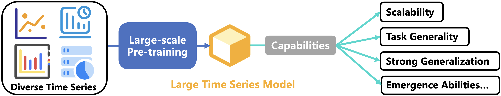
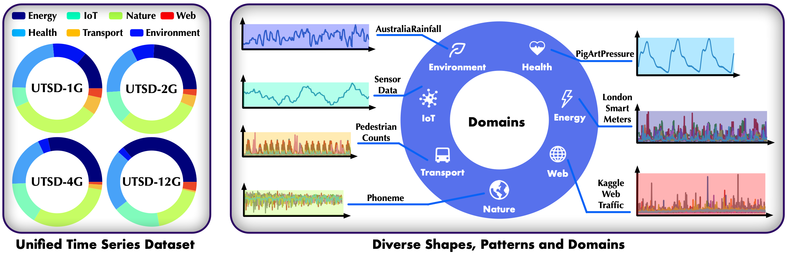
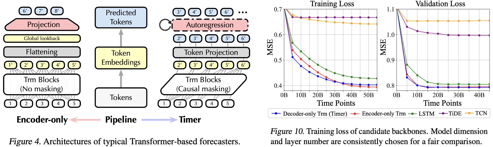
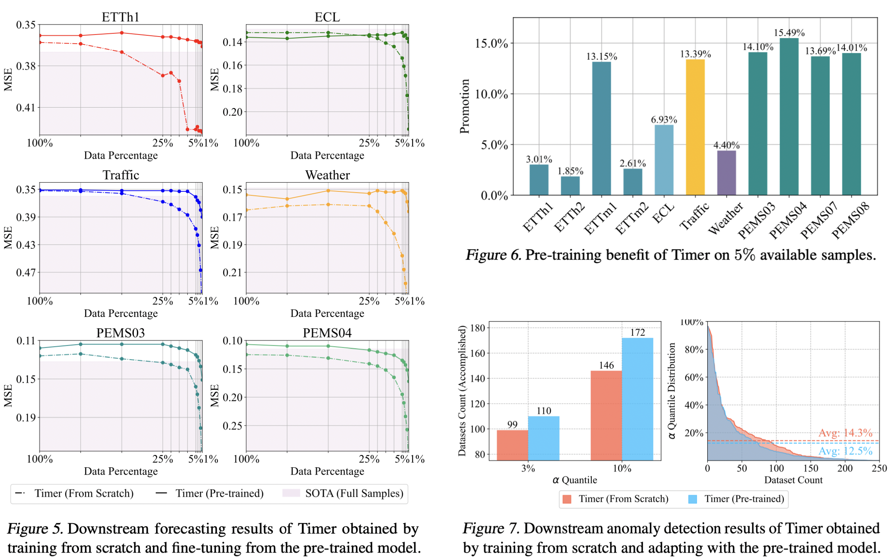
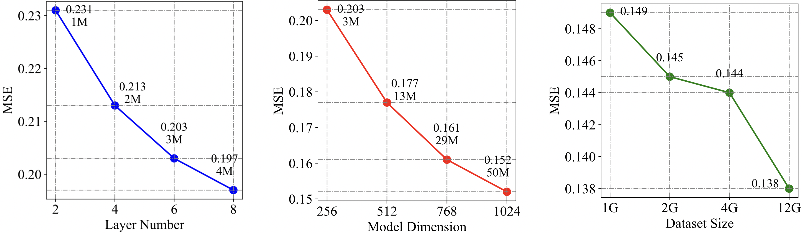
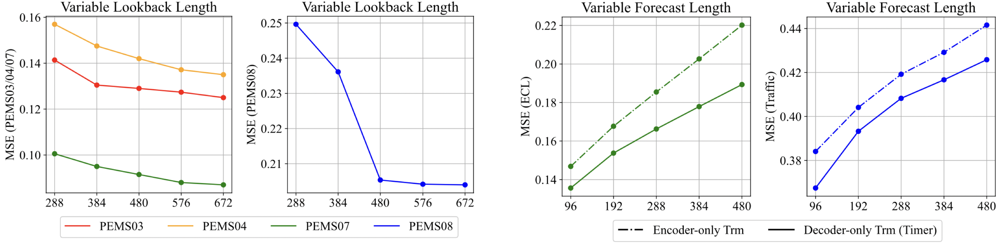
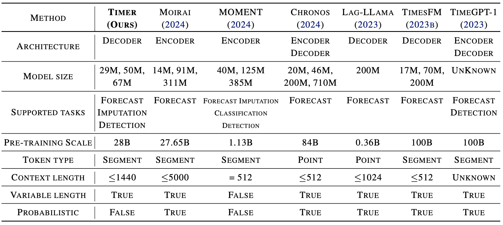
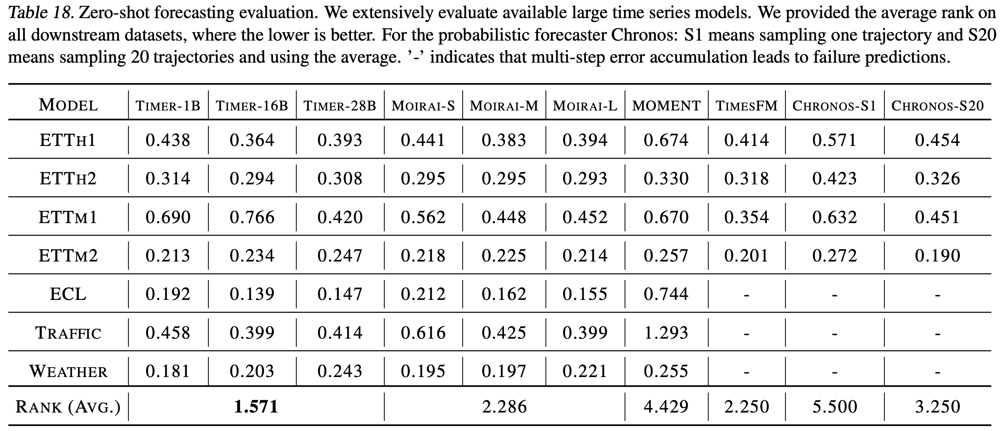
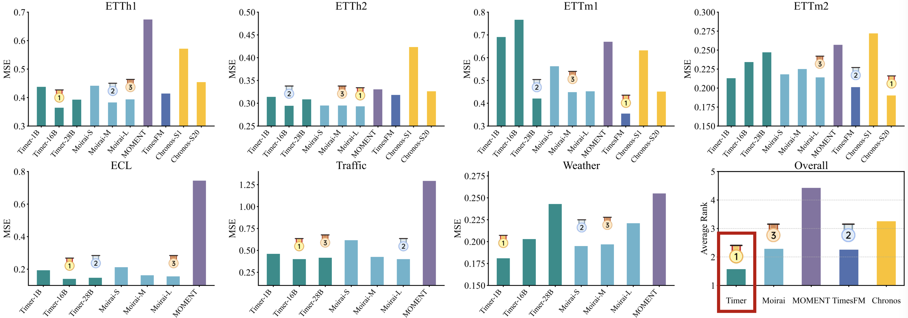

> **Important Note**: Given the prevalence of large time series models. This code base will be soon renamed as ```large-time-series-model-library```. At that time, we will open source the pre-training code of large time series models, large-scale data loading logic, related benchmarks, and well-known large model architecture in the field. Please stay tuned for the update!

# Timer (Large Time Series Model)

This repo provides official code, datasets and checkpoints for [Timer: Generative Pre-trained Transformers Are Large Time Series Models](https://arxiv.org/abs/2402.02368). [[Poster]](https://cloud.tsinghua.edu.cn/f/91da8a3d06984f209461/), [[Slides]](https://cloud.tsinghua.edu.cn/f/b766629dbc584a4e8563/).

# Updates

:triangular_flag_on_post: **News** (2024.6) Pre-training dataset (UTSD) is available in [HuggingFace](https://huggingface.co/datasets/thuml/UTSD). Dataloader is also contained.

:triangular_flag_on_post: **News** (2024.5) Accepted by ICML 2024, a [camera-ready version](https://arxiv.org/abs/2402.02368) of **31 pages**.

:triangular_flag_on_post: **News** (2024.4) The pre-training scale has been extended, enabling zero-shot forecasting.

:triangular_flag_on_post: **News** (2024.2) Releasing model checkpoints and code for adaptation.

## Introduction

**Tim**e Series Transfor**mer** (Timer) is a Generative Pre-trained Transformer for general time series analysis. You can visit our [Homepage](https://thuml.github.io/timer/) for a more detailed introduction.

<p align="center">

</p>

## Datasets

We curate [Unified Time Series Datasets (UTSD)]((https://huggingface.co/datasets/thuml/UTSD)) comprised of **1B time points** and **4 volumes** to facilitate the research on large time series models and pre-training.

<p align="center">

</p>

Our dataset is released in [HuggingFace](https://huggingface.co/datasets/thuml/UTSD) to facilitate the research of large models and pre-training in the field of time series.

###  Usage

You can access and load UTSD in the style of [TSLib](https://github.com/thuml/Time-Series-Library) based on the following:

```bash
# huggingface-cli login
# export HF_ENDPOINT=https://hf-mirror.com 

python ./scripts/UTSD/download_dataset.py

# dataloader
python ./scripts/UTSD/utsdataset.py
```


## Tasks

> **[Forecasting](./scripts/forecast/README.md)**: We provide all scripts as well as datasets for few-shot forecasting in this repo.

> **[Imputation](./scripts/imputation/README.md)**:  We propose segment-level imputation, which is more challenging than point-level imputation.

> **[Anomaly Detection](scripts/anomaly_detection/README.md)**: We provide new benchmarks of predictive anomaly detection on [UCR Anomaly Archive](https://arxiv.org/pdf/2009.13807).

We provide detailed README files illustrating each task under the folder ```./scripts/```.

## Code for Fine-tuning 

1. Install Pytorch and necessary dependencies.

```
pip install -r requirements.txt
```

2. Put downstream datasets from [Google Drive](https://drive.google.com/file/d/1yffcQBcMLasQcT7cdotjOVcg-2UKRarw/view?usp=drive_link) and [Baidu Drive](https://pan.baidu.com/s/1KLwxB0Au-rxpmgY0yu2d3w?pwd=6k73) under the folder ```./dataset/```.

3. Put the checkpoint from [Google Drive](https://drive.google.com/drive/folders/15oaiAl4OO5gFqZMJD2lOtX2fxHbpgcU8?usp=drive_link) and [Baidu Drive](https://pan.baidu.com/s/1Wj_1_qMgyLNLOSUFZK3weg?pwd=r8i1) under the folder ```./checkpoints/```.

4. Train and evaluate the model. We provide the above tasks under the folder ```./scripts/```.

```bash
# forecasting
bash ./scripts/forecast/ECL.sh

# segement-level imputation
bash ./scripts/imputation/ECL.sh

# anomaly detection
bash ./scripts/anomaly_detection/UCR.sh
```

## Train on Custom Dataset

To fine-tune on your time series dataset, you can try out the following steps:

1. The essense is to reload the customized dataloader and load the pre-trained checkpoint (See ```./scripts/``` folder).
2. ```CIDatasetBenchmark```/```CIAutoRegressionDatasetBenchmark``` in the ```data_provider``` folder can train and evaluate models in direct / iterative multi-step mode.


## Approach

### Pre-training and Adaptation

To pre-train on heterogeneous time series, we propose **single-series sequence (S3)**, reserving series variations with the unified context length. Further, we convert forecasting, imputation, and anomaly detection into a **unified generative task**.

<p align="center">

</p>

### Model Architecture

Given the limited exploration of **the backbone for large time series models**, we extensively evaluate candidate backbones and adopt the decoder-only Transformer with autoregressive generation towards LTSMs.

<p align="center">

</p>


## Performance

Timer achieves **state-of-the-art** performance in each task and we present the pre-training benefit on few-shot scenarios.

<p align="center">

</p>

## Scalability

By increasing the parameters and pre-training scale, Timer achieves notable performance improvement: 0.231 $\to$ 0.138 (−40.3%), surpassing the previous state-of-the-art deep forecasters.

<p align="center">

</p>

## Flexible Sequence Length

The decoder-only architecture provides the flexibility to accommodate time series of different lookback and forecast lengths.

<p align="center">

</p>

## Benchmark

Given the significant value to researchers and practitioners, we provide a summary of several concurrent Large Time Series Models:

* [MOMENT](https://arxiv.org/abs/2402.03885) is trained on large scale by masking modeling. It can be applied to zero-shot forecasting by concatenating lookback series with a mask with the length to be predicted.
* [Chronos](https://arxiv.org/abs/2403.07815) is a probabilistic point-level forecaster developed by [Amazon](https://huggingface.co/amazon/chronos-t5-large). Chronos-S1 samples one prediction trajectory and Chronos-S20 uses the mean of sampled 20 trajectories.
* [TimesFM](https://arxiv.org/abs/2310.10688) from Google is trained on 100B time points. We use the official checkpoint from [HuggingFace]( https://huggingface.co/google/timesfm-1.0-200m). It supports dynamic input and output prediction lengths.
* [Moiria]() is developed by Saleforce, exceling at multivariate time series. It has three different [checkpoints](https://huggingface.co/collections/Salesforce/moirai-10-r-models-65c8d3a94c51428c300e0742), labeled as Moiria-S, Moiria-M, and Moiria-L.
* Timer: We evaluate three versions: Timer-1B is pre-trained on UTSD; Timer-16B is pre-trained on UTSD and [Buildings900K](https://arxiv.org/abs/2307.00142); and Timer-28B is pre-trained on UTSD and [LOTSA](https://huggingface.co/datasets/Salesforce/lotsa\_data).

<p align="center">

</p>

We also establish the first **zero-shot benchmark** to measure LTSMs as a general-purpose forecaster.

<p align="center">

</p>

<p align="center">

</p>


It should be noticed that the zero-shot performance of concurrent Large Time Series Models is still lagged behind large models based on few-shot fine-tuning or end-to-end training (similar to the challenges GPT-3 faced in 2020). 


## Citation

If you find this repo helpful, please cite our paper. 

```
@inproceedings{liutimer,
  title={Timer: Generative Pre-trained Transformers Are Large Time Series Models},
  author={Liu, Yong and Zhang, Haoran and Li, Chenyu and Huang, Xiangdong and Wang, Jianmin and Long, Mingsheng},
  booktitle={Forty-first International Conference on Machine Learning}
}
```

## Acknowledgement

We appreciate the following GitHub repos a lot for their valuable code and efforts.
- Time-Series-Library (https://github.com/thuml/Time-Series-Library)
- LOTSA (https://huggingface.co/datasets/Salesforce/lotsa_data) 
- UCR Anomaly Archive (https://arxiv.org/abs/2009.13807)


## Contributors

If you have any questions or want to use the code, feel free to contact:
* Yong Liu (liuyong21@mails.tsinghua.edu.cn)
* Haoran Zhang (zhang-hr24@mails.tsinghua.edu.cn)
* Chenyu Li (lichenyu20@mails.tsinghua.edu.cn)
* Guo Qin (qinguo24@mails.tsinghua.edu.cn)
