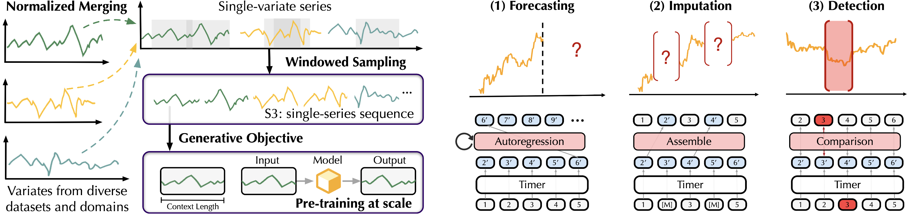
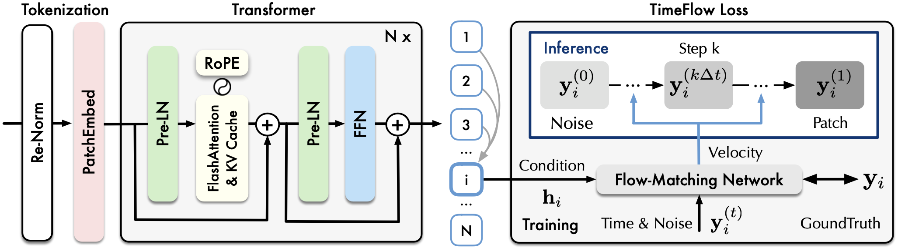

# Large Time-Series Model

This repo provides official code, datasets, and checkpoints for [Timer: Generative Pre-trained Transformers Are Large Time Series Models](https://arxiv.org/abs/2402.02368). [[Poster]](https://cloud.tsinghua.edu.cn/f/91da8a3d06984f209461/) [[Slides]](https://cloud.tsinghua.edu.cn/f/b766629dbc584a4e8563/) and our subsequent works [[Tutorial (CN)]](https://cloud.tsinghua.edu.cn/f/7b88e05d38bb40a1be30/), [[Tutorial (EN)]](https://cloud.tsinghua.edu.cn/f/c5fca76d6fa54f1d891a/).

# Updates

:triangular_flag_on_post: **News** (2025.5) [Sundial](https://arxiv.org/abs/2502.00816), a family of generative time series foundation models has been accepted as **ICML 2025 Oral** (Top 1%). Get your zero-shot probabilistic predictions within milliseconds! [[HuggingFace]](https://huggingface.co/thuml/sundial-base-128m) [[Quickstart]](./examples/quickstart_zero_shot_generation.ipynb) [[Checkpoint]](https://github.com/thuml/OpenLTM/blob/main/load_pth_ckpt.ipynb).

:triangular_flag_on_post: **News** (2025.2) We release an open codebase [OpenLTM](https://github.com/thuml/OpenLTM), which contains the whole pipeline to pre-train and fine-tune large time-series models.

:triangular_flag_on_post: **News** (2024.12) [Timer-XL](https://arxiv.org/abs/2410.04803) for unified forecasting is accepted as **ICLR 2025**. We released a pre-trained model for zero-shot forecasting [[HuggingFace]](https://huggingface.co/thuml/timer-base-84m) [[Quickstart]](./examples/quickstart_zero_shot.ipynb).

:triangular_flag_on_post: **News** (2024.10) We release the pre-training dataset UTSD on [HuggingFace](https://huggingface.co/datasets/thuml/UTSD) or you can use the numpy format [UTSD](https://cloud.tsinghua.edu.cn/f/93868e3a9fb144fe9719/) and this [dataloader](https://github.com/thuml/OpenLTM/blob/main/data_provider/data_loader.py).

:triangular_flag_on_post: **News** (2024.5) Accepted by **ICML 2024**, a [camera-ready version](https://arxiv.org/abs/2402.02368) of **31 pages**.

:triangular_flag_on_post: **News** (2024.2) Releasing model checkpoints and code for fine-tuning on different tasks [[README]](./scripts/README.md).

## Introduction

**Tim**e Series Transfor**mer** (Timer) is a pre-trained Transformer for general time series analysis.
<p align="center">

</p>


## Quick Start

We provide out-of-the-box models for zero-shot forecasting (no training and no GPU needed).

> Example of Timer (Zero-Shot Forecasting)

```
import torch
from transformers import AutoModelForCausalLM

# load pretrain model
model = AutoModelForCausalLM.from_pretrained('thuml/timer-base-84m', trust_remote_code=True)

# prepare input
batch_size, lookback_length = 1, 2880
seqs = torch.randn(batch_size, lookback_length)

# generate forecast
prediction_length = 96
normed_output = model.generate(normed_seqs, max_new_tokens=prediction_length)

print(output.shape)
```

> Example of Sundial (Generative Forecasting)

```
import torch
from transformers import AutoModelForCausalLM

# load pretrain model
# supports different lookback/forecast lengths
model = AutoModelForCausalLM.from_pretrained('thuml/sundial-base-128m', trust_remote_code=True) 

# prepare input
batch_size, lookback_length = 1, 2880 
seqs = torch.randn(batch_size, lookback_length)

# Note that Sundial can generate multiple probable predictions
forecast_length = 96 
num_samples = 20

output = model.generate(seqs, max_new_tokens=forecast_length, num_samples=num_samples)

# use raw predictions for mean/quantiles/confidence-interval estimation
print(output.shape)
```

More usage examples are provided [here](./examples/). See our [HuggingFace](https://huggingface.co/collections/thuml/time-series-foundation-models-67c80ace73299239b651d954) for more information.

## Model Adaption

* For developers interested in **fine-tuning large time-series models or pre-training on customized datasets**, please use [OpenLTM](https://github.com/thuml/OpenLTM), including code scripts and checkpoint of various models.

* For developers interested in **applying large time-series models on other time series analysis tasks** (e.g., imputation and anomaly detection), this repo contains scripts and checkpoints [[README]](./scripts/README.md).

## Datasets

We collect Unified Time Series Datasets (UTSD), which encompass well-curated time series to facilitate the research on large time-series models. Our dataset is released in [HuggingFace](https://huggingface.co/datasets/thuml/UTSD).

<p align="center">

</p>

###  Usage

You can access the data from HuggingFace and load the data in the style of [TSLib](https://github.com/thuml/Time-Series-Library):

```bash
# huggingface-cli login
# export HF_ENDPOINT=https://hf-mirror.com 

python ./scripts/UTSD/download_dataset.py

# dataloader
python ./scripts/UTSD/utsdataset.py
```

In addition, we provide code dataset_evaluation.py for evaluating time series datasets, which you can use to evaluate your Huggingface formatted dataset. The usage of this script is as follows:

```
python ./scripts/UTSD/dataset_evaluation.py --root_path <dataset root path> --log_path <output log path>
```

If you meet troubles when accessing the data, you can also download UTSD in numpy from [[Tsinghua Cloud]](https://cloud.tsinghua.edu.cn/f/93868e3a9fb144fe9719/) and use ```UTSD_Npy``` dataloader [[here]](https://github.com/thuml/OpenLTM/blob/main/data_provider/data_loader.py).


## Introduction

### ICML 2024
We propose [Timer](https://arxiv.org/abs/2402.02368), a decoder-only  **pre-trained** time series Transformer. We propose **single-series sequence (S3) format**, converting diverse series into unified 1D sequences. The predictive model can also be adapted for forecasting, imputation, and anomaly detection [[README]](./scripts/README.md).  

<p align="center">

</p>

### ICLR 2025
 We proposed [Timer-XL](https://arxiv.org/abs/2410.04803) for unified time series forecasting.  It can be used for **supervised training** or **large-scale pre-training**, explicitly modeling **multi-dimensional** time series [[GitHub]](https://github.com/thuml/Timer-XL).  

<p align="center">

</p>

### ICML 2025 Oral
We proposed [Sundial](https://arxiv.org/abs/2502.00816), a family of **generative** time series foundation models, which is pre-trained on **a trillion** (10^12) time points. The model can be applied for both **point** and **probabilistic** forecasting, making **zero-shot** forecasting within milliseconds [[GitHub]](https://github.com/thuml/Sundial).

<p align="center">

</p>

## Citation

If you find this repo helpful, please cite our paper. 

```
@inproceedings{liutimer,
  title={Timer: Generative Pre-trained Transformers Are Large Time Series Models},
  author={Liu, Yong and Zhang, Haoran and Li, Chenyu and Huang, Xiangdong and Wang, Jianmin and Long, Mingsheng},
  booktitle={Forty-first International Conference on Machine Learning}
}

@article{liu2024timer,
  title={Timer-XL: Long-Context Transformers for Unified Time Series Forecasting},
  author={Liu, Yong and Qin, Guo and Huang, Xiangdong and Wang, Jianmin and Long, Mingsheng},
  journal={arXiv preprint arXiv:2410.04803},
  year={2024}
}

@article{liu2025sundial,
  title={Sundial: A Family of Highly Capable Time Series Foundation Models},
  author={Liu, Yong and Qin, Guo and Shi, Zhiyuan and Chen, Zhi and Yang, Caiyin and Huang, Xiangdong and Wang, Jianmin and Long, Mingsheng},
  journal={arXiv preprint arXiv:2502.00816},
  year={2025}
}
```

## Acknowledgment
We appreciate the following GitHub repos a lot for their valuable code and datasets:

* Time-Series-Library (https://github.com/thuml/Time-Series-Library)
* AutoTimes (https://github.com/thuml/AutoTimes)
* LoTSA Data (https://huggingface.co/datasets/Salesforce/lotsa_data)
* UCR Anomaly Archive (https://arxiv.org/pdf/2009.13807)


## Contributors

If you have any questions or want to use the code, feel free to contact:
* Yong Liu (liuyong21@mails.tsinghua.edu.cn)
* Haoran Zhang (zhang-hr24@mails.tsinghua.edu.cn)
* Chenyu Li (lichenyu20@mails.tsinghua.edu.cn)
* Guo Qin (qinguo24@mails.tsinghua.edu.cn)
