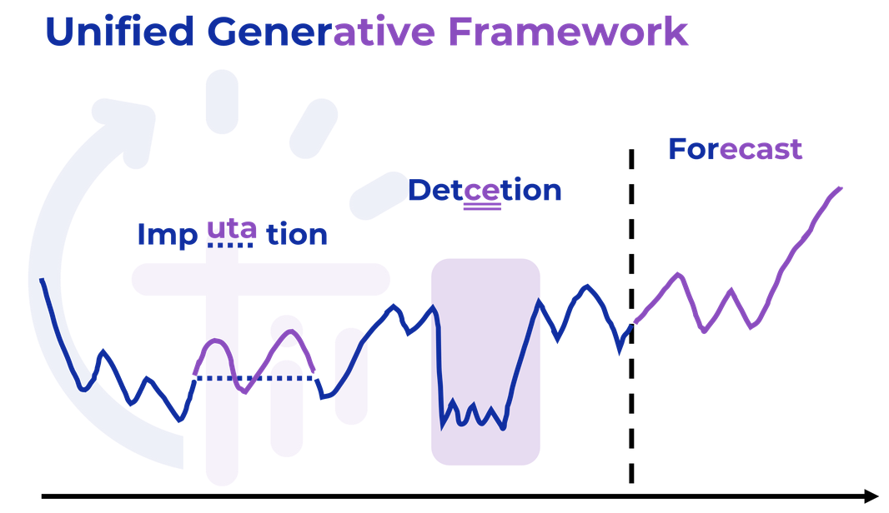
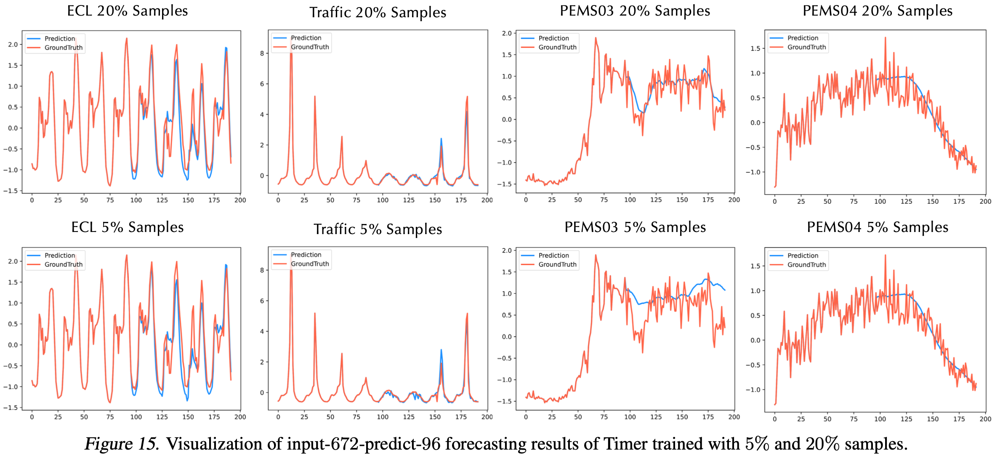
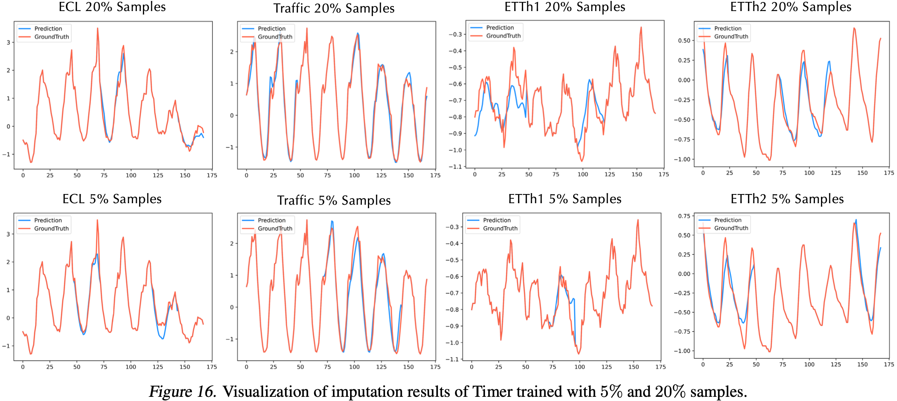
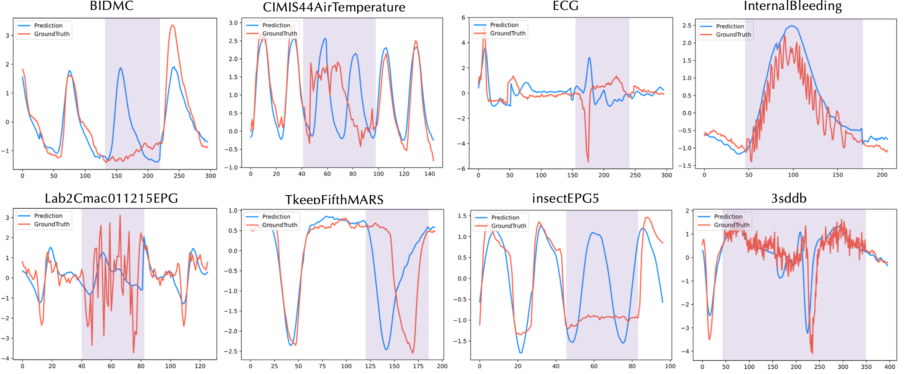
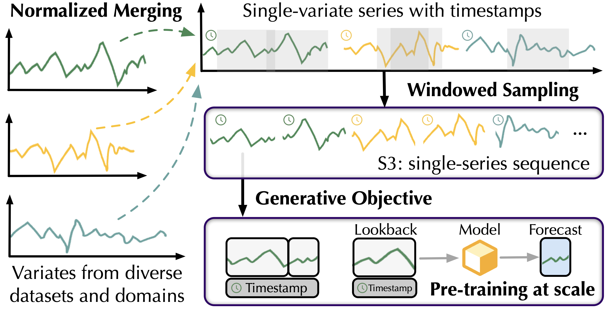
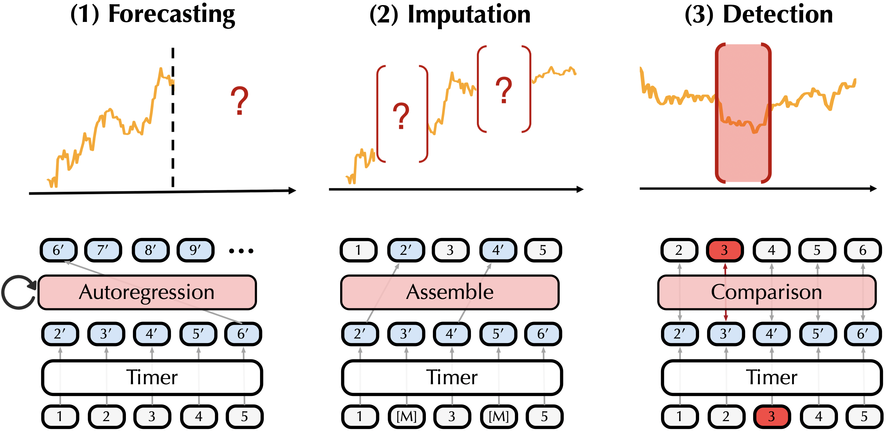

# Timer (Large Time Series Model)

This repo provides official code and checkpoints for [Timer: Transformers for Time Series Analysis at Scale](https://arxiv.org/abs/2402.02368), a Large Time Series Model for unified time series and tasks. 


<p align="center">

</p>

# Updates

:triangular_flag_on_post: **News** (2024.6) The pre-training datasets (UTSD) is available in [HuggingFace](https://huggingface.co/datasets/thuml/UTSD)!

:triangular_flag_on_post: **News** (2024.5) Our paper is accepted by ICML 2024.

:triangular_flag_on_post: **News** (2024.4) The pre-training scale has been extended to **15B** time points, exhibiting the zero-shot capability.

:triangular_flag_on_post: **News** (2024.2) Checkpoint model on UTSD-4G is available.

:triangular_flag_on_post: **News** (2024.2) Releasing the fine-tune code for forecasting.

## Introduction

**Tim**e Series Transfor**mer** (Timer) includes GPT-style Transformers pre-trained on multi-domain time series as Large Time Series Model (LTSM). 
[**[Project Page]**](https://thuml.github.io/timer/)

We curate large-scale datasets comprised of **1B time points**, proposing a unified training strategy with **single-series sequence**, and presenting Timer with the **decoder-only architecture**. As a LTSM, Timer is enabled with:

* **Generalization ability** that one model fits all domains.

* **Task generality** that one model copes with various tasks.

* **Scalability** that the performance increases with the scale of pre-training.

<p align="center">

</p>

## Showcases

> **Forecasting with data scarcity (limited downstream training samples)**

<p align="center">

</p>

> **Segment-level imputation with few-shot samples**

<p align="center">

</p>

> **On-the-fly anomaly detection on UCR Anomaly Archive**

<p align="center">

</p>

## Approach

#### Large Dataset

We curate **Unified Time Series Dataset (UTSD)** that includes 7 domains with up to 1 billion time points with hierarchical capacities to facilitate research of scalability and domain transfer.

<p align="center">

</p>

#### Pre-training Strategy

To facilitate pre-training on extensive time series, we convert heterogeneous series into **single-series sequence (S3)**, **reserving the patterns of series variations with the unified context length**, towards the well-established tokenization like natural language.

<p align="center">

</p>

#### Model Architecture

With the substantial progress of decode-only large language models and evaluation of other backbone alternatives, we adopt the GPT-style Transformer with autoregressive generation towards LTSMs.

<p align="center">

</p>

#### Unified Generative Task Formulation

Timer is applicable on various tasks, which is realized in the unified generative approach.

<p align="center">

</p>

## Performance

We compare Timer with state-of-the-art approaches and present the pre-training benefit on data-scarce scenarios, known as the few-shot cpability of large models.

<p align="center">

</p>


## Scalability

By increasing the parameters and pre-training scale, Timer achieves notable performance improvement: 0.231 $\to$ 0.138 (−40.3%), surpassing the previous state-of-the-art deep forecasters.

<p align="center">

</p>

## Flexible Sequence Length

The decoder-only architecture provides additional flexibility to accommodate time series of different lookback and forecast lengths.

<p align="center">

</p>


## Code for Fine-tuning

1. Install Pytorch and necessary dependencies.

```
pip install -r requirements.txt
```

1. Put the datasets [[Google Drive]](https://drive.google.com/file/d/1yffcQBcMLasQcT7cdotjOVcg-2UKRarw/view?usp=sharing)
[[Tsinghua Cloud]](https://cloud.tsinghua.edu.cn/f/93388a1811584564a40a/) under the folder ```./dataset/```.

2. Download the pre-trained checkpoints and put them under the folder ```./checkpoints/```.
   * Timer_67M_UTSD_4G [[Google]](https://drive.google.com/file/d/1iTaKjDj7IX-GZZjEv7pKGcgyV7GObj-U/view?usp=sharing) [[Tsinghua]](https://cloud.tsinghua.edu.cn/f/e12e5c08131e481f8df6/)

3. Train and evaluate the model. We provide the above tasks under the folder ```./scripts/```.

```
# forecasting
bash ./scripts/forecast/ECL.sh

# TODO: segement-level imputation
bash ./scripts/imputation/ECL.sh

# TODO: anomaly detection on the fly
bash ./scripts/anomaly_detection/UCR.sh
```

4. Training on custom data: Tutorials are provided in this [repo](https://github.com/thuml/iTransformer/tree/main/scripts/multivariate_forecasting).

## Future Work

We are preparing to provide the online service for zero-shot forecasting ([demo](https://thuml.github.io/timer/img/demo.mp4)). Please stay tuned for the update!
  

## Citation

If you find this repo helpful, please cite our paper. 

```
@article{liu2024timer,
  title={Timer: Transformers for Time Series Analysis at Scale},
  author={Liu, Yong and Zhang, Haoran and Li, Chenyu and Huang, Xiangdong and Wang, Jianmin and Long, Mingsheng},
  journal={arXiv preprint arXiv:2402.02368},
  year={2024} 
}
```

## Acknowledgement

We appreciate the following GitHub repos a lot for their valuable code and efforts.
- Time-Series-Library (https://github.com/thuml/Time-Series-Library)
- iTransformer (https://github.com/thuml/iTransformer)

## Contact

If you have any questions or want to use the code, feel free to contact:
* Yong Liu (liuyong21@mails.tsinghua.edu.cn)
* Haoran Zhang (z-hr20@mails.tsinghua.edu.cn)
