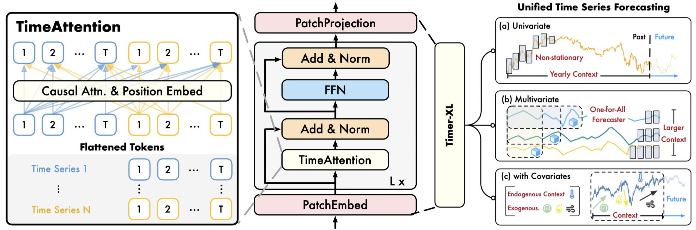

> [!NOTE]
> We release a open codebase [**OpenLTM**](https://github.com/thuml/OpenLTM) to explore the design philosophy of large time-series models, which contains a simple pipeline to train large time-series models :)


# Timer (Large Time-Series Model)

This repo provides official code, datasets and checkpoints for [Timer: Generative Pre-trained Transformers Are Large Time Series Models](https://arxiv.org/abs/2402.02368). [[Poster]](https://cloud.tsinghua.edu.cn/f/91da8a3d06984f209461/), [[Slides]](https://cloud.tsinghua.edu.cn/f/b766629dbc584a4e8563/).

# Updates

:triangular_flag_on_post: **News** (2024.12) Timer-XL for unified forecasting is accepted as  [ICLR 2025](https://arxiv.org/abs/2410.04803). We released a pre-trained model on **260B time points** [[Performance]](./figures/zeroshot_result.png) [[Checkpoint]](https://huggingface.co/thuml/timer-base-84m) [[Quickstart]](./examples/quickstart_zero_shot.ipynb).

:triangular_flag_on_post: **News** (2024.10) We release numpy format [UTSD](https://cloud.tsinghua.edu.cn/f/93868e3a9fb144fe9719/). An simple dataloader for large-scale pre-training is [here](https://github.com/thuml/OpenLTM/blob/main/data_provider/data_loader.py).

:triangular_flag_on_post: **News** (2024.6) Pre-training dataset (UTSD) is available in [HuggingFace](https://huggingface.co/datasets/thuml/UTSD).

:triangular_flag_on_post: **News** (2024.5) Accepted by ICML 2024, a [camera-ready version](https://arxiv.org/abs/2402.02368) of **31 pages**.

:triangular_flag_on_post: **News** (2024.2) Releasing model checkpoints and code for fine-tuning.

## Introduction

**Tim**e Series Transfor**mer** (Timer) is a Generative Pre-trained Transformer for general time series analysis.
<p align="center">

</p>


## Zero-Shot Forecasting
We provide the checkpoint to make predictions without training samples. See our [HuggingFace Repo](https://huggingface.co/thuml/timer-base-84m) for the detialed information and usage.

> Example

```
import torch
from transformers import AutoModelForCausalLM

# load pretrain model
model = AutoModelForCausalLM.from_pretrained('thuml/timer-base-84m', trust_remote_code=True)

# prepare input
batch_size, lookback_length = 1, 2880
seqs = torch.randn(batch_size, lookback_length)

# generate forecast
prediction_length = 96
normed_output = model.generate(normed_seqs, max_new_tokens=prediction_length)

print(output.shape)
```

There's room for improvement in this small model. We are actively working around it and are glad to see constructive suggestions and noteworthy cases.

## Datasets

We collect Unified Time Series Datasets (UTSD), which encompass well-curated time series to facilitate the research on large time-series models. Our dataset is released in [HuggingFace](https://huggingface.co/datasets/thuml/UTSD).

<p align="center">

</p>

###  Usage

You can access the data from HuggingFace and load the data in the style of [TSLib](https://github.com/thuml/Time-Series-Library):

```bash
# huggingface-cli login
# export HF_ENDPOINT=https://hf-mirror.com 

python ./scripts/UTSD/download_dataset.py

# dataloader
python ./scripts/UTSD/utsdataset.py
```

If you meet troubles when accessing the data, you can also download UTSD in numpy from [[Tsinghua Cloud]](https://cloud.tsinghua.edu.cn/f/93868e3a9fb144fe9719/) and use ```UTSD_Npy``` dataloader from [[OpenLTM]](https://github.com/thuml/OpenLTM/blob/main/data_provider/data_loader.py).

## For Developers 

For developers interest in fine-tune large model, we provide fine-tuning code for different example tasks. The checkpoint is pre-trained and fine-tuned using [TSLib](https://github.com/thuml/Time-Series-Library).

> [!NOTE]
>  We recommend using [this checkpoints on HuggingFace](https://huggingface.co/thuml/timer-base-84m) for **evaluation and deployment** (e.g., zero-shot forecasting). However, this huggingface checkpoint is not compatiable with the following fine-tuning code.
>


### Supported Tasks

> **[Forecasting](./scripts/forecast/README.md)**: We provide scripts for full- or few-shot forecasting.

> **[Imputation](./scripts/imputation/README.md)**:  We adopt segment-level imputation, which is more challenging than point-level imputation.

> **[Anomaly Detection](scripts/anomaly_detection/README.md)**: We build a benchmark using [UCR Anomaly Archive](https://arxiv.org/pdf/2009.13807). The task aims to predict normal future series and detect anomalies in advance.

We provide the README files illustrating each task under the folder ```./scripts/```.


### Code for Fine-tuning 

1. Use Python 3.10 and install necessary dependencies.

```
pip install -r requirements.txt
```

2. Put downstream datasets from [Google Drive](https://drive.google.com/file/d/1yffcQBcMLasQcT7cdotjOVcg-2UKRarw/view?usp=drive_link) or [Baidu Drive](https://pan.baidu.com/s/1KLwxB0Au-rxpmgY0yu2d3w?pwd=6k73) under the folder ```./dataset/```.

3. Put the checkpoint from [Google Drive](https://drive.google.com/drive/folders/15oaiAl4OO5gFqZMJD2lOtX2fxHbpgcU8?usp=drive_link) or [Baidu Drive](https://pan.baidu.com/s/1Wj_1_qMgyLNLOSUFZK3weg?pwd=r8i1) under the folder ```./checkpoints/```.

4. Train and evaluate the model. We provide the above tasks under the folder ```./scripts/```.

```bash
# forecasting
bash ./scripts/forecast/ECL.sh

# segement-level imputation
bash ./scripts/imputation/ECL.sh

# anomaly detection
bash ./scripts/anomaly_detection/UCR.sh
```

### Train on Custom Dataset

To fine-tune on your time series dataset, you can try out the following steps:

1. The key is to reload the customized dataloader and load the pre-trained checkpoint (See ```./scripts/``` folder).
2. ```CIDatasetBenchmark```/```CIAutoRegressionDatasetBenchmark``` in the ```data_provider``` folder can train and evaluate models in direct / iterative multi-step mode.


> [!NOTE]
> For developers interested in developing and improving your own large time-series models, we recomment this repo [OpenLTM](https://github.com/thuml/OpenLTM).
> 

## Approach

### Unified Pre-training

To pre-train on heterogeneous time series, we propose **single-series sequence (S3)**, reserving series variations into the unified 1D context. Further, we convert forecasting, imputation, and anomaly detection into a **unified generative task**.

<p align="center">

</p>

### Model Architecture

We evaluate various candidate backbones and eventually adopt the **decoder-only Transformer**, which provides notable **generalization performance** and **flexibility** that accommodate varying-length time series.

<p align="center">

</p>


## Performance

Timer achieves **state-of-the-art** performance in [zero-shot forecasting](./figures/zeroshot_result.png) and few-shot adaptation.

<p align="center">

</p>

## Scalability

By scaling, Timer achieves notable performance improvement. Currently, we provide the base version containing 84M paramaters that is pre-trained on 260B time points, which supports a maximum context length of 2880.

<p align="center">

</p>

## Subsequent Work

We proposed Timer-XL for unified forecasting in this [[Paper]](https://arxiv.org/abs/2410.04803).  It can be used for **task-specific training** or **scalable pre-training**, handling **arbitrary-length** and **any-variable** time series [[Repo]](https://github.com/thuml/Timer-XL).  

<p align="center">

</p>

## Citation

If you find this repo helpful, please cite our paper. 

```
@inproceedings{liutimer,
  title={Timer: Generative Pre-trained Transformers Are Large Time Series Models},
  author={Liu, Yong and Zhang, Haoran and Li, Chenyu and Huang, Xiangdong and Wang, Jianmin and Long, Mingsheng},
  booktitle={Forty-first International Conference on Machine Learning}
}

@article{liu2024timer,
  title={Timer-XL: Long-Context Transformers for Unified Time Series Forecasting},
  author={Liu, Yong and Qin, Guo and Huang, Xiangdong and Wang, Jianmin and Long, Mingsheng},
  journal={arXiv preprint arXiv:2410.04803},
  year={2024}
}
```

## Contributors

If you have any questions or want to use the code, feel free to contact:
* Yong Liu (liuyong21@mails.tsinghua.edu.cn)
* Guo Qin (qinguo24@mails.tsinghua.edu.cn)
* Haoran Zhang (zhang-hr24@mails.tsinghua.edu.cn)
* Chenyu Li (lichenyu20@mails.tsinghua.edu.cn)
