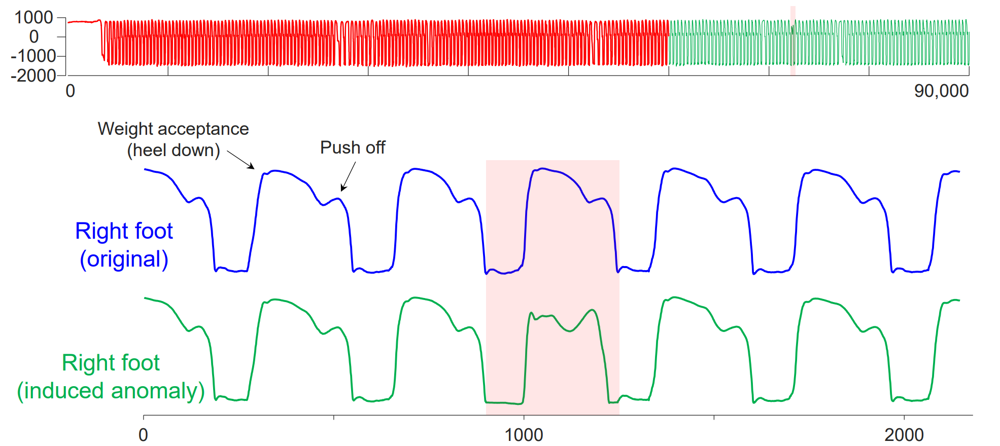

# Anomaly Detection

Anomaly detection is vital in industry and operations. Previous methods ([Xu et al., 2021](https://arxiv.org/abs/2110.02642); [Wu et al., 2022](https://openreview.net/forum?id=ju_Uqw384Oq)) typically tackle the unsupervised scenario in a reconstructedtive approach, where a model is trained to reconstruct the input series, and the output is regarded as the normal series. Based on our generative model, we cope with anomaly detection in a predictive approach, which utilizes the observed segments to predict the future segment, and the predicted segment will be established as the standard to be compared with the actual value received. Unlike the previous method requiring to collect time series of a period for reconstruction, our predictive approach allows for segment-level anomaly detection on the fly. Thus, the task is converted into a next token prediction task.


## Dataset

[UCR Anomaly Archive](https://arxiv.org/pdf/2009.13807) is evaluated as the benchmark. We provide the processed dataset: [Google Drive](https://drive.google.com/file/d/1yffcQBcMLasQcT7cdotjOVcg-2UKRarw/view?usp=drive_link) and [Tsinghua Cloud](https://cloud.tsinghua.edu.cn/f/6bc31f9a003b4d75a10b/).


## Task Description

<p align="center">

</p>

We introduce UCR Anomaly Archive ([Wu & Keogh, 2021](https://arxiv.org/pdf/2009.13807)) that contains 250 tasks. In each task, a single normal time series is provided for training, and the model should locate the position of an anomaly in the test series. We first train a predictive model on the training set and calculate the MSE between the predicted series and ground truth on the test set. We use the MSE of all segments as the confidence level, the segments with higher than an given quantile of confidence are labeled as potential positions of anomalies.

## Scripts

The script is now compatible with predictive models. If you're interested in developing the predictive anomaly detection benchmark, we are also looking forward to any pull requests. 

```bash
model_name=Timer
ckpt_path=checkpoints/Timer_anomaly_detection_1.0.ckpt
seq_len=768
d_model=256
d_ff=512
e_layers=4
patch_len=96
subset_rand_ratio=0.01
dataset_dir="./dataset/UCR_Anomaly_FullData"

for file_path in "$dataset_dir"/*
do
data=$(basename "$file_path")
python -u run.py \
  --task_name anomaly_detection \
  --is_training 1 \
  --root_path ./dataset/UCR_Anomaly_FullData \
  --data_path $data \
  --model_id UCRA_$data \
  --ckpt_path $ckpt_path \
  --model $model_name \
  --data UCRA \
  --features M \
  --seq_len $seq_len \
  --pred_len 0 \
  --d_model $d_model \
  --d_ff $d_ff \
  --patch_len $patch_len \
  --e_layers $e_layers \
  --train_test 0 \
  --batch_size 128 \
  --use_ims \
  --subset_rand_ratio $subset_rand_ratio \
  --train_epochs 10
done
```
