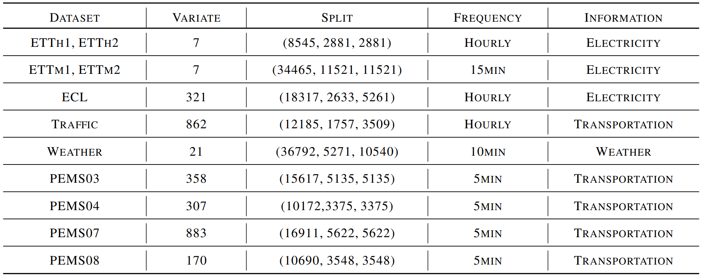

# Time Series Forecasting

## Dataset

Time series forecasting is essential and presents challenges in real-world applications. To thoroughly evaluate the performance, we elaborately establish the benchmark, including ETT, ECL, Traffic, Weather, and PEMS adopted in [Liu et al. (2023b)](https://arxiv.org/abs/2310.06625).

<p align="center">

</p>

## Task Description

### Few-shot Generalization

To construct data-scarce scenarios, we perform retrieval with the uniform interval in the training split according to the sampling ratio and conduct random shuffling at the end of each epoch to train the model. We keep the same validation and testing sets of original downstream datasets and train the baseline model and Timer with the same set of training samples.

Set `--subset_rand_ratio` to decide the ratio of training samples in few-shot scenarios.

### Direct Multi-step (DMS) and Iterative Multi-step (IMS) Forecasting

GPT has the flexibility to address unfixed context length and excels at multi-step generation by iteratively sliding and enlarging input tokens. However. small time series models generally refrain from iterative multi-step forecasting to mitigate error accumulation.

Timer adopts autoregression, a.k.a. Iterative Multi-step (IMS) in time series forecasting. During inference, we concatenate the prediction with the previous lookback series and iteratively generate the next token until reaching the desired length. We also implement Direct Multi-step (DMS)) approach for typical encoder-only forecasters. 

Set `--use_ims` to evaluate decoder-only models in the IMS way. If the option is not activated, the script evaluates encoder-only models with a fair comparison.


## Training on Custom Dataset

To train with your time series dataset, you can try out the following steps:

1. Read through the ```CIDatasetBenchmark``` and ```CIAutoRegressionDatasetBenchmark```classes under the ```data_provider/data_loader``` folder, which provides the functionality to load and process time series files and evaluate models in DMS mode or IMS mode.
2. File should be ```csv``` format with the first column containing timestamps and the following columns containing the variates of time series.

## Scripts

```bash
model_name=Timer
seq_len=672
label_len=576
pred_len=96
output_len=96
patch_len=96
ckpt_path=checkpoints/Timer_forecast_1.0.ckpt
data=electricity

# set data scarcity ratio
for subset_rand_ratio in 0.01 0.02 0.03 0.04 0.05 0.1 0.15 0.2 0.25 0.5 0.75 1
do
# train
torchrun --nnodes=1 --nproc_per_node=4 run.py \
  --task_name forecast \
  --is_training 0 \
  --ckpt_path $ckpt_path \
  --root_path ./dataset/$data/ \
  --data_path $data.csv \
  --data custom \
  --model_id electricity_sr_$subset_rand_ratio \
  --model $model_name \
  --features M \
  --seq_len $seq_len \
  --label_len $label_len \
  --pred_len $pred_len \
  --output_len $output_len \
  --e_layers 8 \
  --factor 3 \
  --des 'Exp' \
  --d_model 1024 \
  --d_ff 2048 \
  --batch_size 2048 \
  --learning_rate 3e-5 \
  --num_workers 4 \
  --patch_len $patch_len \
  --train_test 0 \
  --subset_rand_ratio $subset_rand_ratio \
  --itr 1 \
  --gpu 0 \
  --use_ims \
  --use_multi_gpu
done
```
